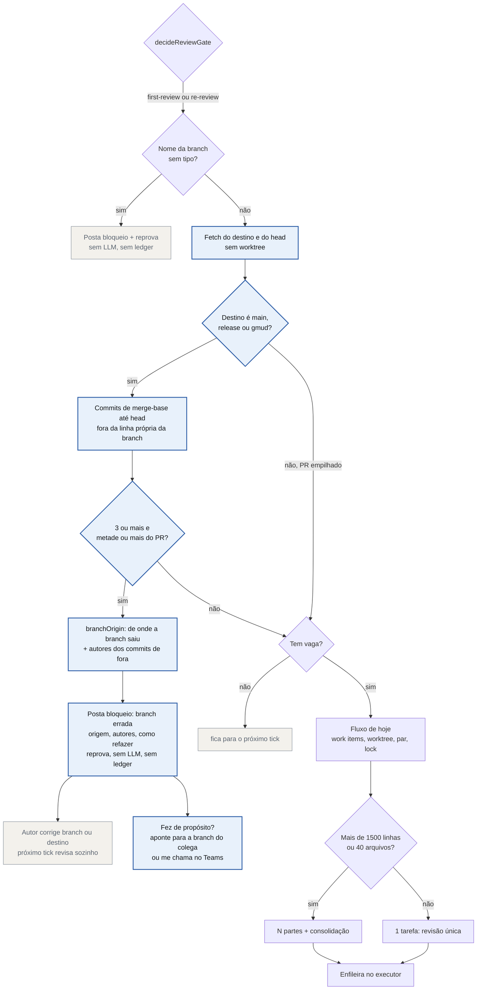

# Proposta: barrar PR que arrasta commit dos outros antes de revisar

Status: **proposta, não implementada**. Compare com o fluxo atual em `docs/pr-review-flow.md`.

## O problema medido (28/09/2026)

Das 10 maiores revisões, **8 eram PRs apontados para a branch errada**. O caso típico: uma correção de rótulo foi
para a release corrente com cerca de 10 mil linhas, 52 commits, **50 deles de outras pessoas**, 7 autores. O diff
não era do autor, era a release seguinte vindo junto.

- 12 dos 47 PRs medidos arrastavam commits de fora (3 ou mais, e pelo menos metade dos commits do PR).
- Esses 12 custaram **15% de todos os tokens de revisão** (piso: a conta inclui PRs sem tamanho conhecido).
- Tirando esses, só 4 PRs passaram de 1500 linhas: um de biblioteca de componentes (13 mil linhas, legítimo), um
  empilhado em outra task e dois de cerca de 2 mil. Tamanho sozinho não é o problema.

O bloqueio de hoje (`blockOnCarriedRelease`) só olha PR **para main** carregando a próxima release. Os casos
acima iam para a release corrente carregando a seguinte, e passaram.

## Mudanças

1. **Detectar arrasto por commit, não por nome de branch.** Depois do fetch, sem worktree: commits entre o
   merge-base com o destino e o head que não estão na linha própria da branch (`--first-parent`). Se forem 3 ou
   mais e pelo menos metade do PR, a PR está arrastando trabalho dos outros.
2. **Barrar como os bloqueios de hoje.** Posta o achado na PR com a origem provável (`branchOrigin`), os
   autores de fora e o comando para refazer a branch a partir do destino certo. Reprova, não roda LLM, não mexe
   no ledger. Quando o autor corrige a branch ou o destino, a revisão roda sozinha no próximo tick.
   O texto termina com a saída para quem fez de propósito: "Se você juntou a branch de um colega de propósito,
   aponte o destino para a branch dele. Se acha que está certo assim, me chama no Teams." 
3. **Sem aprovação por PR.** Nenhuma pergunta no Telegram. PR grande do próprio autor segue o fluxo de hoje
   (divide em partes acima de 1500 linhas).
4. **PR empilhado não é arrasto.** Destino `task/*`, `feature/*` ou outra branch de trabalho: compara contra o
   destino real, que já contém a base. Só release, gmud e main passam pela checagem.

## Em aberto

- **Corte de 3 commits e metade do PR.** Nos 47 PRs medidos separa limpo: os 12 com arrasto tinham de 3 a 52
  commits de fora, e os demais tinham zero. Pode apertar com o tempo.
- **Merge intencional de outra branch.** Um autor que junta a branch de um colega de propósito cai no bloqueio.
  O comentário oferece duas saídas: apontar o destino para a branch do colega (vira PR empilhado) ou te chamar
  no Teams quando ele acha que está certo.
- **Substitui o `blockOnCarriedRelease`.** A regra nova cobre o caso dele (para main carregando a release). Dá
  para manter os dois na primeira versão e remover o antigo depois de ver os bloqueios reais.
