# Fluxo do revisor de PR (sensor)

A parte determinística do revisor, em `src/sensors/azure-pr-review.js` (`runAzurePrReview`). Roda a cada
tick e decide **se** e **como** uma PR vira tarefa de revisão. O que a LLM faz dentro da tarefa está no
grafo de `skills/pr-review-pipeline/SKILL.md`.

O painel (aba **Fluxo PR**) desenha este bloco e o grafo da skill. Ao mudar o sensor, atualize o bloco
abaixo no mesmo commit.

```mermaid
flowchart TD
    T0[Tick do sensor] --> H[Manutenção<br/>destrava login, retoma publicação,<br/>solta claim órfão]
    H --> CH[advanceChunkedReviews<br/>partes prontas liberam a consolidação]
    CH --> PUB[publishCompletedReviews<br/>ver bloco Publicar]
    PUB --> L[Lista PRs ativas por repo<br/>até 100]
    L --> G0{Gate barato<br/>sem threads}
    G0 -- PR minha / draft / antes do início --> X0[pula]
    G0 -- ok --> TH[Busca threads]
    TH --> ZL[Limpa lock zumbi]
    ZL --> FU[Coleta cobranças pendentes<br/>para o digest]
    FU --> IF{Tarefa da PR<br/>já em andamento?}
    IF -- sim --> X1[pula]
    IF -- não --> AR[Encaminha respostas do autor<br/>e confere comentários resolvidos]
    AR --> VA{Tudo resolvido<br/>no código?}
    VA -- sim --> APR[Aprova o head]
    VA -- não --> G1{decideReviewGate}
    G1 -- já aprovei / sem head / ledger / lock / em dia --> X2[pula]
    G1 -- first-review ou re-review --> CAND[Candidata]
    CAND --> ORD[Ordena por data de criação<br/>mais antiga primeiro]
    ORD --> BO{Backoff de falha<br/>ao preparar?}
    BO -- sim --> X3[pula]
    BO -- não --> PRB{preReviewBlock}
    PRB -- nome da branch sem tipo --> BLK[Posta bloqueio + reprova<br/>sem tocar no ledger]
    PRB -- release arrastada para main --> BLK
    PRB -- ok --> SL{Tem vaga?<br/>max_parallel, padrão 2}
    SL -- não --> X4[fica para o próximo tick]
    SL -- sim --> CL[Claim no ledger]
    CL --> P1[Work items + stories no Azure]
    P1 --> P2[Fetch + worktree no head]
    P2 --> P3[Branch de origem, PR par,<br/>gate de destino]
    P3 --> P4[Achados anteriores<br/>+ convenções do repo]
    P4 --> P5[planForDiff<br/>git diff --numstat]
    P5 --> SZ{mais de 1500 linhas<br/>ou 40 arquivos?}
    SZ -- não --> ONE[1 tarefa: revisão única]
    SZ -- sim --> PARTS[N tarefas de parte<br/>+ 1 consolidação esperando]
    ONE --> LK[Posta lock na PR]
    PARTS --> LK
    LK --> Q[Enfileira no executor]
    Q --> RUN[LLM roda a skill<br/>pr-review-pipeline]
    RUN --> PUB2[Próximo tick: publicar]

    subgraph Publicar
      PUB2 --> R0{Resultado utilizável?}
      R0 -- não, 1a vez --> R1[reroda a revisão]
      R0 -- não, de novo --> R2[marca falha no lock<br/>+ Telegram]
      R0 -- sim --> R3[Injeta gates do sensor<br/>e cenários da US]
      R3 --> R4[Fecha comentários antigos<br/>corrigidos no código]
      R4 --> R5[Posta achados novos]
      R5 --> R6[Resumo por último + voto]
      R6 --> R7{needs-work?}
      R7 -- sim --> R8[Oferta de cobrança<br/>ou Telegram direto]
      R7 -- não --> R9[Digest]
    end
```

Onde está o custo: tudo de **Work items** até **Enfileira** roda antes de qualquer decisão por tamanho, e
o tamanho (`planForDiff`) só decide entre dividir ou não. Nenhum ramo hoje deixa de revisar por tamanho.
